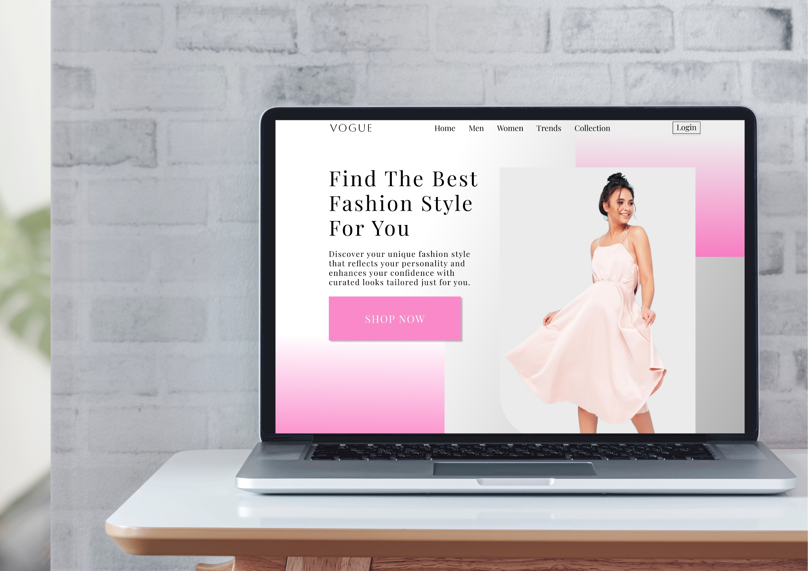

# Vogue Clothing Website

## Description
Vogue Clothing is a stylish and modern fashion website design that provides users with a seamless shopping experience. The website highlights curated fashion collections tailored to individual styles and preferences.

## Features
- Elegant and modern UI design
- Seamless shopping experience
- Featured fashion collections
- User-friendly navigation
- Responsive and visually appealing design

## Technologies Used
- Figma (UI/UX Design)
- Adobe Photoshop (Graphics Editing)

## How to Use
1. Browse through the curated fashion styles.
2. Click on "Shop Now" to explore the collection.
3. Use the navigation menu to access different categories.
4. Enjoy a seamless shopping experience.

## Contact
For more design inspirations, visit [Vintage Design Vibes](https://www.instagram.com/vintage_design_vibes/).

